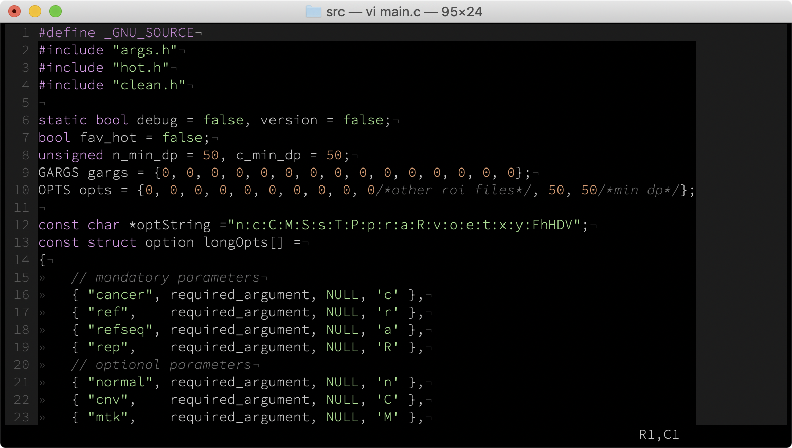

* vim theme stolen from Atom's darkmode

* The font in the screenshot is a modified version of <a href="Hasklig" target="blank">Hasklig</a> ExtraLight. When you select ExtraLight, the Bold version is hacked to use Light instead. This is stunning on retina displays
